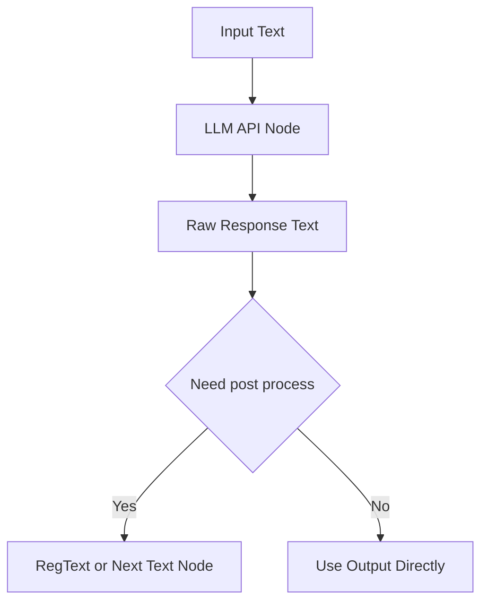
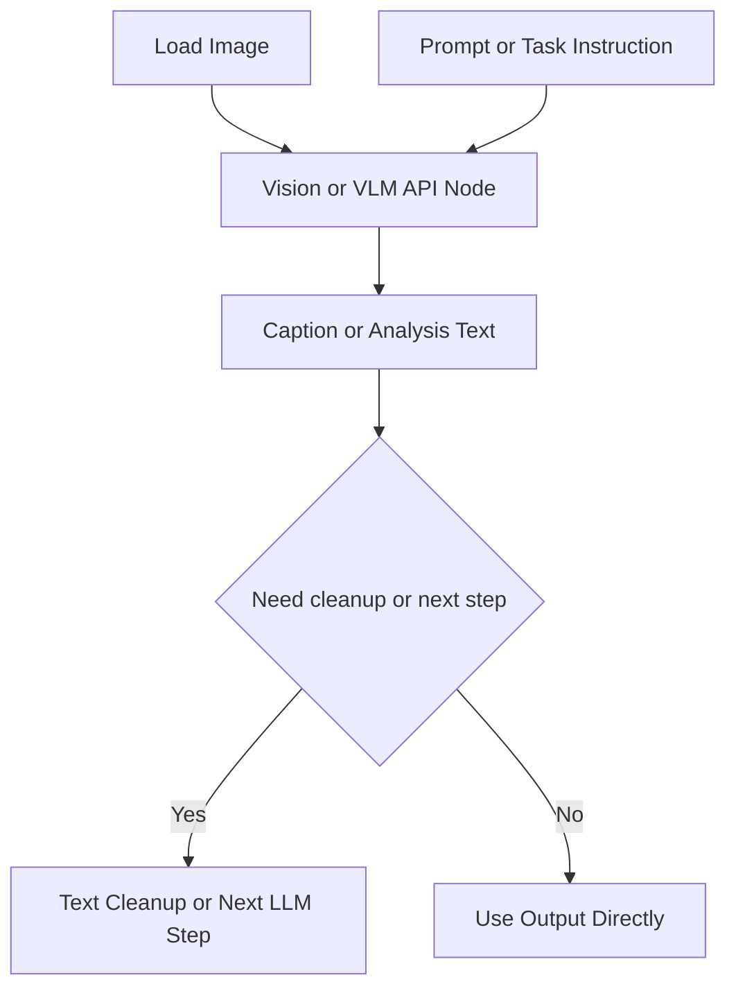
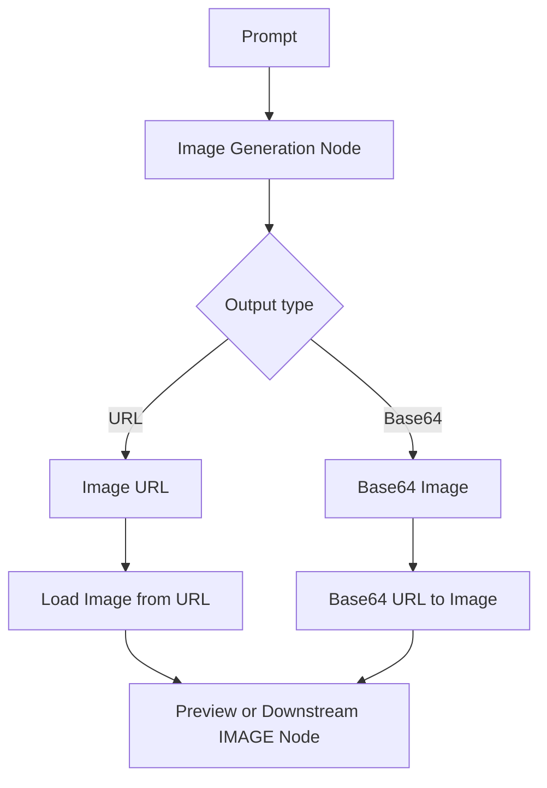
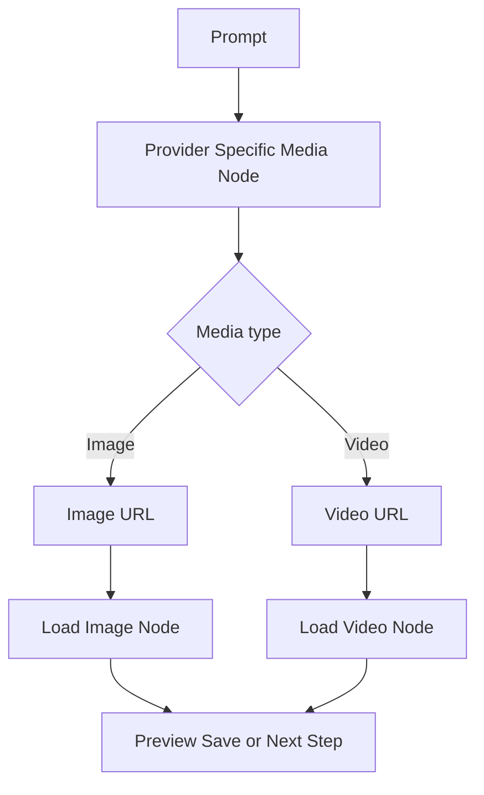
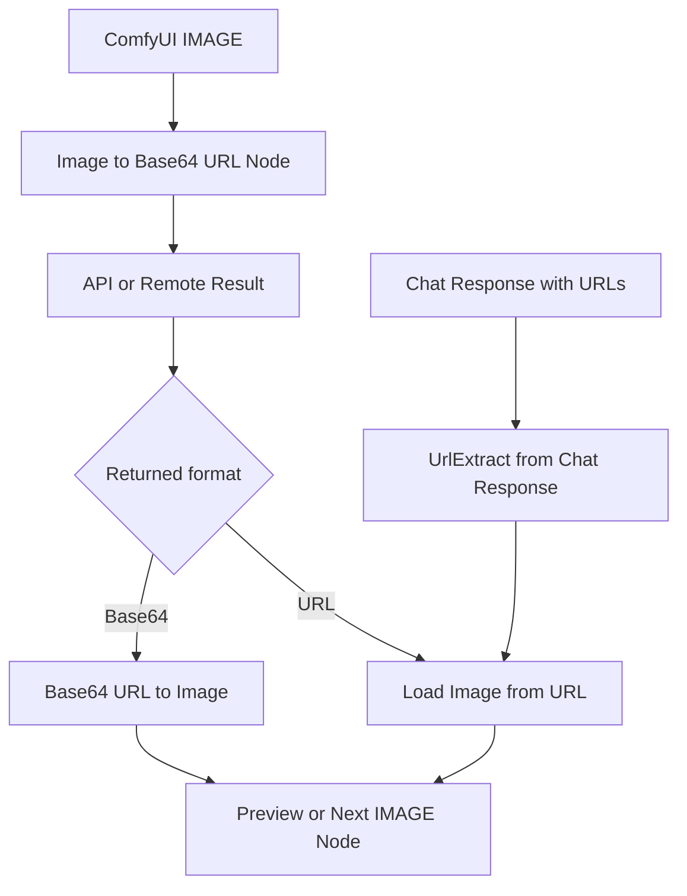

# ComfyUI BillBum APIset Nodes

ComfyUI BillBum APIset Nodes is a custom node pack for calling external APIs from ComfyUI workflows. It focuses on OpenAI-compatible LLM and VLM endpoints, image generation APIs, provider-specific image and video APIs, and a small set of utility nodes for moving data between text, URLs, images, and base64 payloads.

This repository is useful if you want to:

- run text generation from chat-style LLM APIs inside ComfyUI
- caption or analyze images with vision-capable models
- call image generation APIs such as DALL-E, SD3, Flux, GPT-Image-1, Ideogram, and Recraft
- test custom image-generation endpoints without writing glue code
- convert between image tensors, URLs, and base64 data in a workflow

## Included Node Groups

The pack exports nodes in these categories:

- LLM nodes: standard text generation, streaming response nodes, text input helpers, text concatenation, and token-drop utilities
- Vision nodes: image captioning and image understanding through vision-capable chat APIs
- Image generation nodes: DALL-E, Stable Diffusion 3, Flux, GPT-Image-1, Ideogram, Recraft, HyprLab, and generic image API calls
- Video and provider-specific nodes: Doubao Seedance and Seedance2 video generation, plus Seedream image generation
- Utility nodes: image to base64 URL, base64 URL to image, URL image loading, chat response parsing, and video loading from URLs

Some legacy nodes are still exported with names marked as Old. They remain available for compatibility with existing workflows.

## Installation

### Option 1: Install with ComfyUI Manager

Search for billbum in ComfyUI Manager and install the node pack.

### Option 2: Install from Git URL

If you use Install via Git URL in ComfyUI Manager, paste this repository URL:

```bash
https://github.com/AhBumm/ComfyUI_BillBum_APIset_Nodes.git
```

If you prefer a manual install, clone it into your ComfyUI custom_nodes directory:

```bash
git clone https://github.com/AhBumm/ComfyUI_BillBum_APIset_Nodes.git
```

### Install Python dependencies

Install the packages from [requirements.txt](requirements.txt) with the same Python environment that runs ComfyUI:

```bash
pip install -r requirements.txt
```

Dependencies used by this project:

- tenacity
- openai
- pillow
- requests
- numpy
- tiktoken
- urlextract

After installation, restart ComfyUI so the custom nodes are discovered correctly.

## Quick Start

1. Install the node pack and Python dependencies.
2. Restart ComfyUI.
3. Open the example workflow file [minimal_api_group.json](minimal_api_group.json).
4. Replace the placeholder API keys and base URLs with your own provider settings.
5. Choose a model that is valid for the provider and endpoint you are using.
6. Run one of the minimal workflow groups to confirm your setup.

The bundled example workflow includes these starter groups:

- Minimal LLM Group
- Minimal VisionLM Group
- Minimal DALL-E Image Gen Group
- Minimal Flux Image Gen Group
- Minimal SD3 Image Gen Group
- Minimal T2I API Call Group

## Workflow Patterns by Node Group

These diagrams use a GitHub-safe Mermaid style: plain flowcharts, simple node shapes, and basic decision branches. They only show the most common external connections between nodes. Internal widget settings such as model, API URL, API key, seed, size, and similar parameters are intentionally omitted.

### 1. Text and LLM Nodes

Applies to stream LLM nodes, legacy chat nodes, text input helpers, concatenation, and token-limiting utilities.



Use this pattern for prompt rewriting, prompt cleanup, chat generation, extraction, or any workflow where the main output is text.

### 2. Vision and Captioning Nodes

Applies to vision-capable API nodes and image-to-text analysis chains.



Use this when you want caption generation, image analysis, prompt extraction, or visual QA before another text or image-generation step.

### 3. Image Generation Nodes

Applies to DALL-E, SD3, Flux, GPT-Image-1, Ideogram, Recraft, HyprLab, and similar text-to-image endpoints.



Use this as the default pattern for most text-to-image endpoints, whether the API returns an image URL or a base64 payload.

### 4. Provider-Specific Media Nodes

Applies to provider-specific image or video nodes such as Doubao Seedream, Seedance, and Seedance2.



Use this when a provider exposes a custom media workflow that does not fit the generic OpenAI-compatible image request shape.

### 5. Utility and Conversion Nodes

Applies to nodes that bridge ComfyUI image tensors, URLs, base64 payloads, and extracted text.



Use these nodes when an API expects encoded image input, when an API returns URLs instead of tensors, or when you need to turn chat output back into usable media.

### Quick Mapping

| Goal | Recommended starting nodes | Typical output |
| --- | --- | --- |
| Generate or rewrite text | API Node for Stream Response LLMs, Custom LLM API Node, Input Text, Concat Text Strings Node | text |
| Caption or analyze an image | Vision LLMs API Node, Non-System Prompt VLMs API Node | text |
| Generate an image from text | Dall-E Custom API Node, Stable Diffusion 3 API Node, Custom Flux API Node, Custom GPTImage1 API Node, Custom Image Generation API Call Node | image URL or base64 |
| Generate provider-specific media | HyprLab ImageGen API Node, Doubao Seedream ImageGen API Node, Doubao Seedance VideoGen API Node, Doubao Seedance2 VideoGen API Node | image URL or video URL |
| Convert API outputs into ComfyUI data | Base64 URL to Image Node, Load Image from URL (BillBum), UrlExtract from Chat Response, Image to Base64 URL Node | IMAGE, URL, or cleaned text |

## Provider Notes

Most nodes in this repository are designed around OpenAI-compatible request formats, but the actual base URL, API key, and model name depend on the service you use.

Examples visible in the repository include endpoints for:

- OpenAI-compatible APIs
- HyprLab
- DashScope-compatible vision and chat APIs
- Doubao image and video APIs

The repository does not enforce a single provider. You are expected to choose a valid base URL, API key, and model combination for each node.

## Node Overview

Here are the main exported nodes you will likely use first:

### Text and LLM

- API Node for Stream Response LLMs
- Custom LLM API Node (Old)
- LLM StreamResponse Node (Old)
- Input Text
- Concat Text Strings Node
- Dropout by MaxToken Node

### Vision and Captioning

- Vision LLMs API Node (Old)
- Non-System Prompt VLMs API Node

### Image Generation

- Dall-E Custom API Node
- Stable Diffusion 3 API Node
- Custom Flux API Node
- Custom GPTImage1 API Node
- Custom Ideogram API Node
- Custom Recraft API Node
- Custom Image Generation API Call Node
- HyprLab ImageGen API Node
- Doubao Seedream ImageGen API Node

### Utilities and Media

- Image to Base64 URL Node
- Base64 URL to Image Node
- Load Image from URL (BillBum)
- UrlExtract from Chat Response
- Regular ResponseText to 1linePrompt Node
- Load Video From URL (VHS Compatible)
- Load&Save Video From URL (Comfy Core)
- Doubao Seedance VideoGen API Node
- Doubao Seedance2 VideoGen API Node

## Example Workflow Notes

The sample workflow is meant to show minimal wiring for each API category rather than provide a polished end-to-end app.

Some nodes referenced in [minimal_api_group.json](minimal_api_group.json) come from other ComfyUI packs, such as text box or URL-loading helper nodes. If those nodes are missing in your setup, you can still use the BillBum API nodes themselves and replace the helper nodes with equivalents available in your environment.

## Troubleshooting

- If the nodes do not appear in ComfyUI, make sure the repository is inside custom_nodes and restart ComfyUI after installing dependencies.
- If a node returns authentication errors, check the API key, base URL, and whether the endpoint matches the provider.
- If a request fails with model errors, confirm that the selected model is actually available on the provider you configured.
- If image or video helper nodes fail, verify that the returned URL or base64 payload format matches what the downstream node expects.
- If the sample workflow cannot load fully, install the missing third-party helper nodes or replace them with local equivalents.

## Repository Files

- [__init__.py](__init__.py) defines the exported node mappings and display names.
- [billbum_modified.py](billbum_modified.py) contains the main API and utility node implementations.
- [nodes4tuzi.py](nodes4tuzi.py) contains streaming LLM, URL image, and video-loading helpers.
- [nodes4hypr.py](nodes4hypr.py) contains the HyprLab image node.
- [nodes4doubao.py](nodes4doubao.py) contains Doubao image and video nodes.
- [minimal_api_group.json](minimal_api_group.json) provides bundled example workflow groups.

## License

This project is distributed under the terms in [LICENSE](LICENSE).